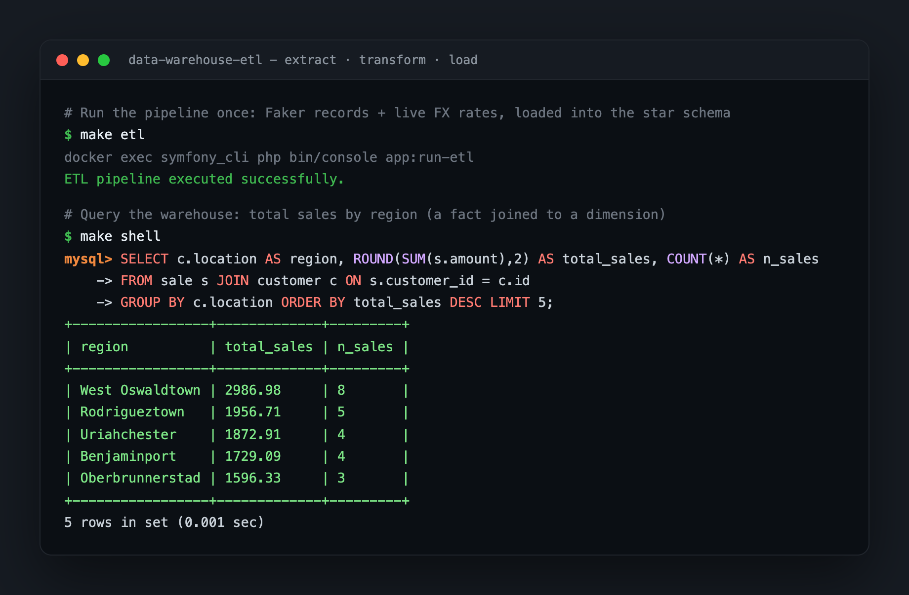
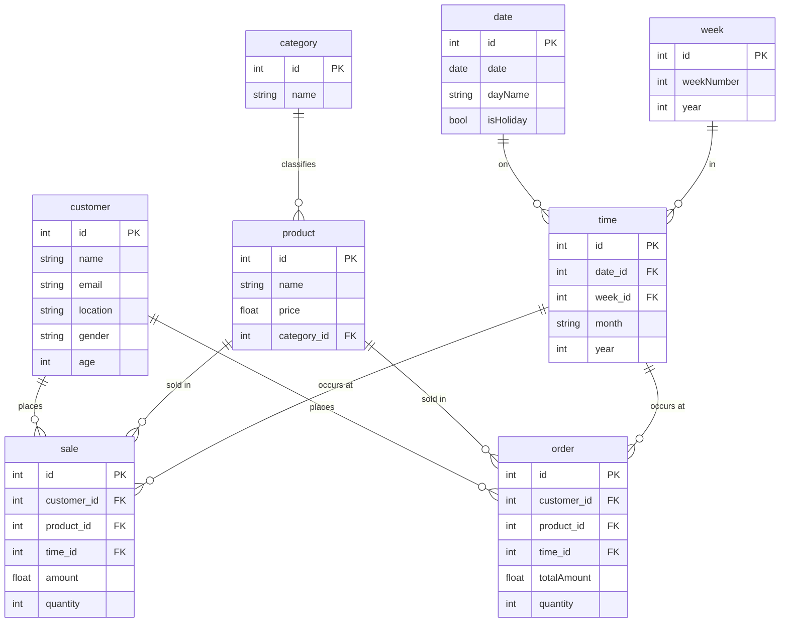
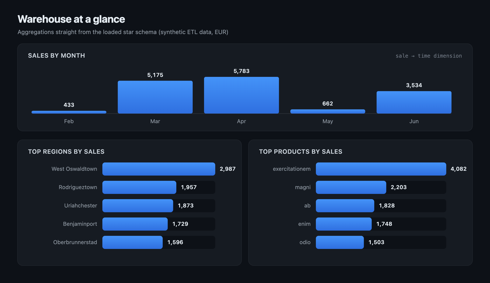

# Data Warehouse ETL Pipeline

A small **Symfony** service that builds a **star-schema data warehouse** from an
ETL pipeline. It:

1. **Extracts** data from multiple sources: generated records (Faker), a public
   exchange-rate API, and an optional CSV file.
2. **Transforms** it, normalising names, emails, and prices into a consistent
   shape.
3. **Loads** it into a **MariaDB** warehouse modelled as facts and dimensions.
4. **Automates** the whole run on a schedule (hourly) via Symfony Messenger.

- **Repo:** <https://github.com/IgliHoxha/data-warehouse-with-etl-pipeline-with-automation>
- **Stack:** Symfony 7.1 · PHP 8.2 · Doctrine ORM · Symfony Messenger + Scheduler · MariaDB
- **Runtime:** Docker (PHP CLI container + MariaDB)

<p align="center">
  
</p>

---

## Quick start

Everything runs inside Docker. The `make` targets wrap the container commands.

```bash
make install-local   # copies .env, starts containers, installs deps, migrates
make etl             # run the pipeline once and populate the warehouse
```

Prefer to drive it by hand? The same steps, explicitly:

```bash
cp .env.example .env
docker compose up -d --build
docker exec -it symfony_cli composer install
docker exec -it symfony_cli php bin/console doctrine:migrations:migrate
docker exec -it symfony_cli php bin/console app:run-etl
```

This brings up two services:

| Service | Container | Purpose |
| --- | --- | --- |
| Symfony | `symfony_cli` | PHP CLI running the ETL commands. |
| MariaDB | `mariadb` | The data warehouse (exposed on `localhost:3306`). |

### Make targets

| Command | Does |
| --- | --- |
| `make up` / `down` | Start / stop the containers. |
| `make install-local` | One-shot setup: `.env`, build, install, migrate. |
| `make migrate` | Run database migrations. |
| `make etl` | Run the ETL pipeline once. |
| `make schedule` | Consume the scheduler so the pipeline runs hourly. |
| `make test` | Run the PHPUnit suite. |
| `make format` / `format-check` | Auto-format / check style (PHP-CS-Fixer). |
| `make lint` | Static analysis (PHPStan). |
| `make check` | CI-style: format check + lint + tests. |
| `make shell` | Open a shell in the Symfony container. |

Run `make help` for the full list.

---

## Environment variables (`.env`)

| Var | Purpose |
| --- | --- |
| `APP_ENV` | `dev` or `prod`. |
| `APP_SECRET` | Framework secret; generate a random hex string. |
| `DATABASE_URL` | Doctrine DSN. Defaults to the bundled MariaDB service. |
| `MESSENGER_TRANSPORT_DSN` | Scheduler transport (Doctrine-backed by default). |

Copy `.env.example` and adjust: the defaults line up with `docker-compose.yml`,
so it works unchanged for local development.

---

## The pipeline

The pipeline is three services under [`src/Service/ETL/`](src/Service/ETL/):

- **`DataExtractor`**: generates customers, products, sales, orders, and time
  records with Faker; fetches live currency rates from a public API to price
  products in EUR; and can read an optional CSV.
- **`DataTransformer`**: cleans and normalises fields (title-cases names,
  fills missing emails/prices).
- **`DataLoader`**: persists everything into the warehouse via Doctrine,
  wrapping each load in a transaction.

It can be triggered three ways:

```bash
# 1. On demand
docker exec -it symfony_cli php bin/console app:run-etl

# 2. On a schedule: every hour (see src/Schedule/EtlPipelineScheduler.php)
docker exec -it symfony_cli php bin/console messenger:consume scheduler_etl_pipeline -vv

# 3. As a message: dispatch EtlPipelineMessage onto the bus
```

> **Optional CSV source.** `app:run-etl` also enriches the warehouse from
> `src/Csv/shopping_trends.csv` if that file exists. It is not bundled; drop any
> CSV with `Customer ID`, `Age`, `Gender`, `Location`, `Item Purchased`, and
> `Category` columns there to include it, or leave it out and the step is
> skipped.

---

## Warehouse schema

A classic star schema: two fact tables (`sale`, `order`) referencing shared
dimensions, with `category`, `date`, and `week` as supporting dimensions.



---

## What the warehouse looks like

After a run, the star schema is populated and self-consistent. The tables below
are real output from this warehouse. The source records are synthetic (Faker),
so the figures grow on every `make etl`; these are from two runs.

<p align="center">
  
</p>

**A peek at the data**

A few rows from two dimension tables. The transformer title-cases names and the
extractor prices products in EUR from the live exchange-rate feed.

`customer` dimension (first 5 rows):

| id | name | email | location | gender | age |
| ---: | --- | --- | --- | --- | ---: |
| 1 | Jordan Flatley Phd | yasmeen71@example.net | South Brenden | Female | 50 |
| 2 | Zora Johnson | considine.josiane@example.net | Benjaminport | Male | 18 |
| 3 | Brandon Gerlach | dereck.grady@example.com | Hollisstad | Male | 23 |
| 4 | Hoyt Romaguera | eloise.abbott@example.net | Mikelstad | Male | 19 |
| 5 | Haylie Witting | vincenzo48@example.com | East Kayceeshire | Male | 58 |

`product` dimension (first 5 rows, joined to `category`):

| id | product | price (EUR) | category |
| ---: | --- | ---: | --- |
| 1 | excepturi | 855.32 | Clothing |
| 2 | odio | 294.57 | Clothing |
| 3 | iure | 518.61 | Books |
| 4 | magni | 387.30 | Clothing |
| 5 | ducimus | 325.01 | Books |

**Rows loaded**

| Entity | Rows |
| --- | ---: |
| `customer` (dimension) | 20 |
| `product` (dimension) | 20 |
| `sale` (fact) | 40 |
| `order` (fact) | 40 |
| `category` (dimension) | 4 |
| `time` (dimension) | 40 |

**Sales by region** (fact `sale` joined to the `customer` dimension, top 5)

| Region | Total sales (EUR) | Sales |
| --- | ---: | ---: |
| West Oswaldtown | 2,986.98 | 8 |
| Rodrigueztown | 1,956.71 | 5 |
| Uriahchester | 1,872.91 | 4 |
| Benjaminport | 1,729.09 | 4 |
| Oberbrunnerstad | 1,596.33 | 3 |

**Sales by product** (top 5)

| Product | Qty sold | Total sales (EUR) |
| --- | ---: | ---: |
| exercitationem | 29 | 4,082.09 |
| magni | 15 | 2,203.39 |
| ab | 12 | 1,828.07 |
| enim | 15 | 1,747.79 |
| odio | 4 | 1,502.52 |

**Sales by month** (fact `sale` joined to the `time` dimension)

| Month | Total sales (EUR) | Sales |
| --- | ---: | ---: |
| April | 5,782.79 | 14 |
| March | 5,175.08 | 12 |
| June | 3,533.85 | 10 |
| May | 662.09 | 3 |
| February | 432.71 | 1 |

**Integrity and completeness**

Every fact points at a real dimension row, and no required field is missing:

| Check | Orphaned / null rows |
| --- | ---: |
| `sale` without a `customer` | 0 |
| `sale` without a `product` | 0 |
| `sale` without a `time` | 0 |
| `order` without a `customer` | 0 |
| `order` without a `product` | 0 |
| `product` without a `category` | 0 |
| `customer` missing name / email / location | 0 |
| `product` missing price | 0 |

<details>
<summary>The SQL behind these tables</summary>

Run against the `symfony` database (`make shell` then `mysql`, or any client on
`localhost:3306`).

```sql
-- Row counts
SELECT COUNT(*) FROM customer;
SELECT COUNT(*) FROM sale;
SELECT COUNT(*) FROM `order`;

-- Sales by region, product, and month
SELECT c.location AS region, ROUND(SUM(s.amount), 2) AS total_sales, COUNT(*) AS n_sales
FROM sale s JOIN customer c ON s.customer_id = c.id
GROUP BY c.location ORDER BY total_sales DESC;

SELECT p.name AS product, SUM(s.quantity) AS qty_sold, ROUND(SUM(s.amount), 2) AS total_sales
FROM sale s JOIN product p ON s.product_id = p.id
GROUP BY p.name ORDER BY total_sales DESC;

SELECT t.month, ROUND(SUM(s.amount), 2) AS total_sales, COUNT(*) AS n_sales
FROM sale s JOIN time t ON s.time_id = t.id
GROUP BY t.month;

-- Referential integrity: orphaned facts return zero rows
SELECT s.* FROM sale s LEFT JOIN customer c ON s.customer_id = c.id WHERE c.id IS NULL;
SELECT o.* FROM `order` o LEFT JOIN product p ON o.product_id = p.id WHERE p.id IS NULL;

-- Completeness: no missing required fields
SELECT * FROM customer WHERE name IS NULL OR email IS NULL OR location IS NULL;
SELECT * FROM product WHERE price IS NULL;
```

</details>

---

## Tests

PHPUnit covers the ETL services (extract, transform, load).

```bash
make test
# or a single file:
make test-file F=tests/Service/ETL/DataExtractorTest.php
```

---

## Code quality

Formatting is handled by **PHP-CS-Fixer** (the `@Symfony` ruleset,
[`.php-cs-fixer.dist.php`](.php-cs-fixer.dist.php)) and static analysis by
**PHPStan** ([`phpstan.dist.neon`](phpstan.dist.neon)).

```bash
make format        # auto-format src/ and tests/
make format-check  # report style issues without writing (CI)
make lint          # PHPStan static analysis
make check         # format-check + lint + tests, in one go
```

---

## Project layout

```
src/
  Command/RunEtlPipelineCommand.php   app:run-etl: runs the pipeline on demand
  Schedule/EtlPipelineScheduler.php   hourly cron for the pipeline
  Message/EtlPipelineMessage.php      the queued ETL job
  MessageHandler/EtlPipelineHandler.php  runs the pipeline off the bus
  Service/ETL/
    DataExtractor.php    Faker + exchange-rate API + optional CSV
    DataTransformer.php  field cleaning / normalisation
    DataLoader.php       Doctrine persistence (transactional)
  Entity/                warehouse tables (facts + dimensions)
migrations/              Doctrine schema migrations
tests/Service/ETL/       unit tests for the pipeline
Dockerfile · docker-compose.yml · Makefile
```

---

## License

[MIT](LICENSE) © 2026 Igli Hoxha
